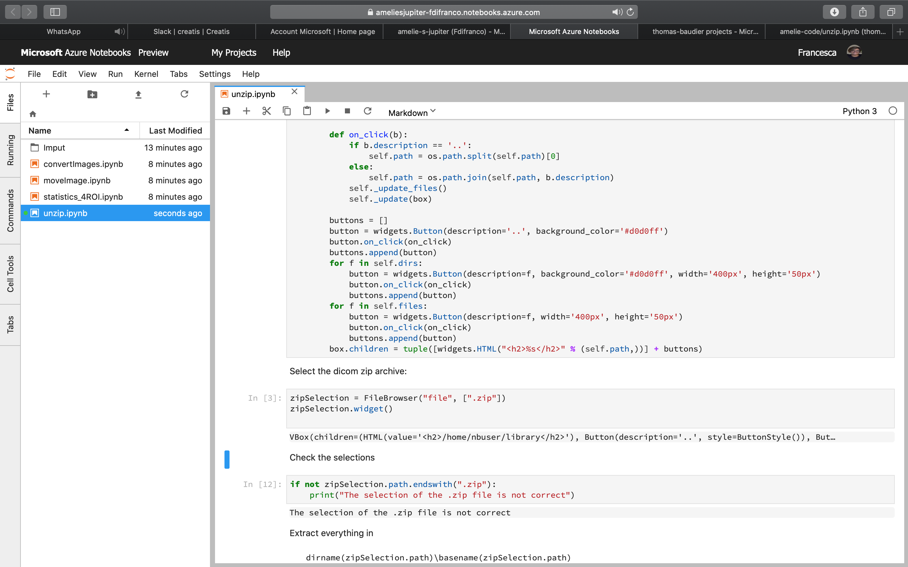
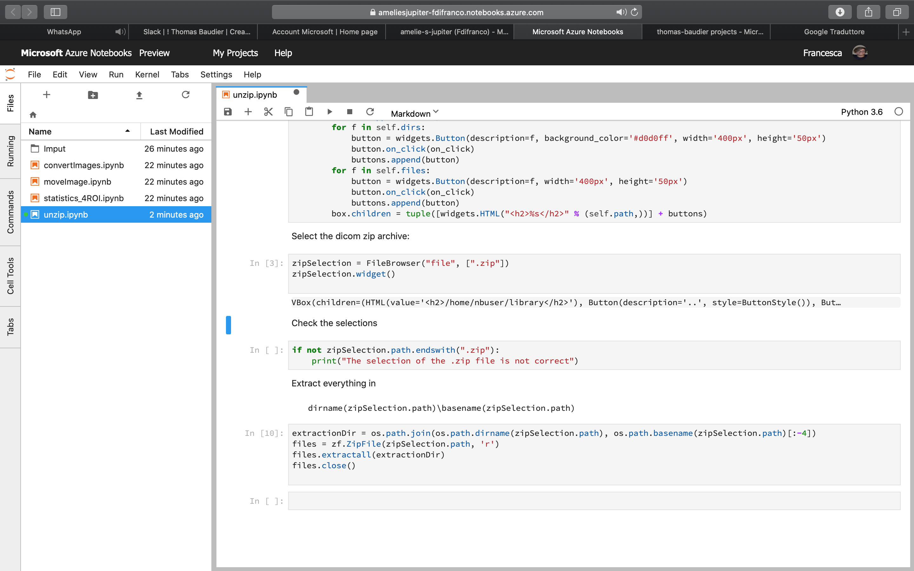
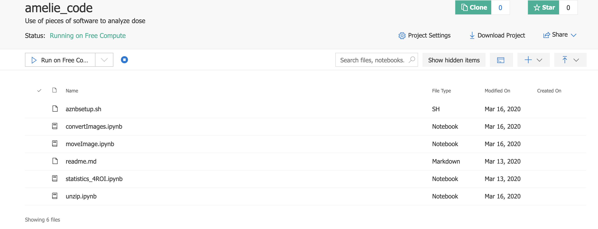
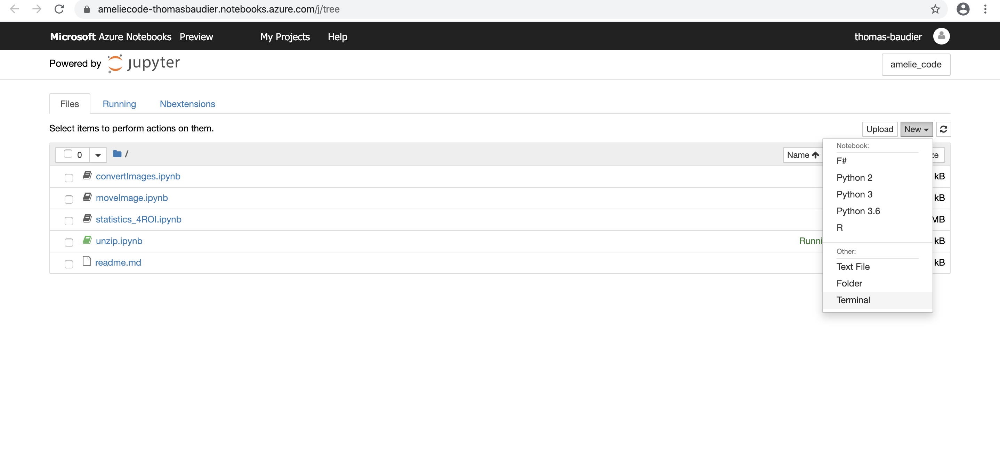
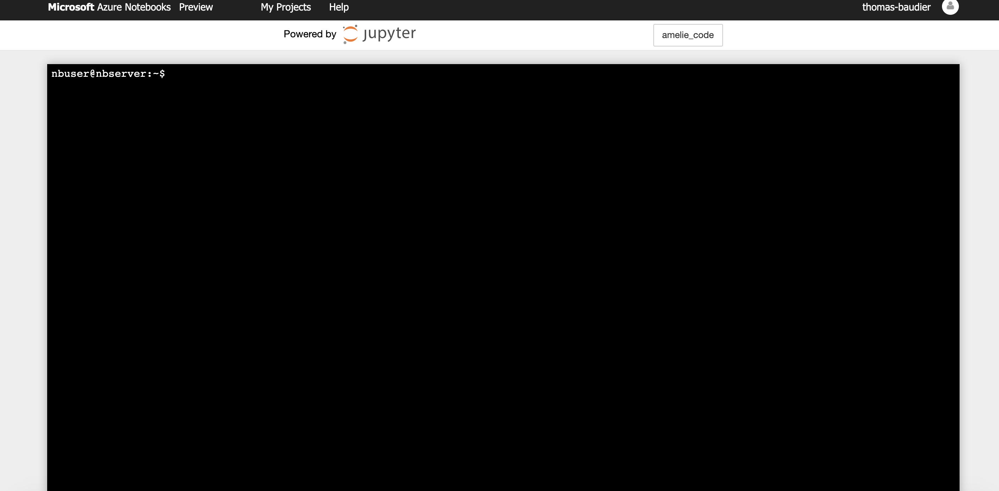
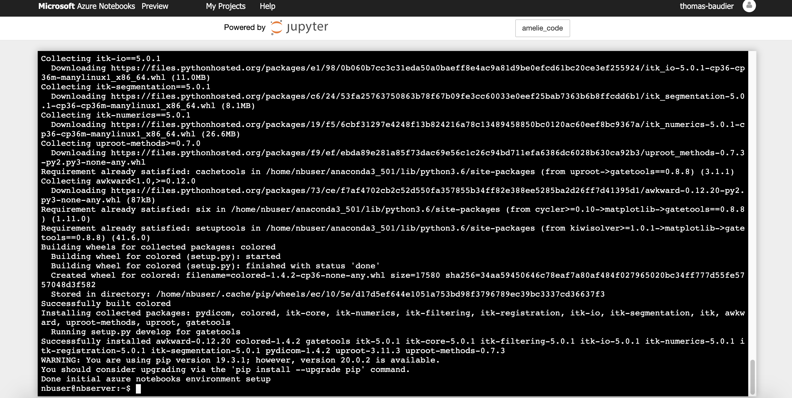

# How to configure Jupyter Notebook on Azure

## Create an account

You can create an account on:

[https://notebooks.azure.com/](https://notebooks.azure.com/)

And you can upload your notebooks or create your first one. Open one Notebook and you should see something like that:



With Python 3 written in the top right corner.

First we need to open it with Python 3.6. So click on:

```

Kernel, and choose Change Kernel, and Python3.6

```

Now you can see Python 3.6 on the top right:



## Install requiere packages:

Upload at the root folder, the file ```aznbsetup.sh```containing the following lines:

```
#!/bin/bash
​
source /home/nbuser/anaconda3_501/bin/activate
​
git clone https://github.com/OpenGATE/GateTools.git gateTools/
​
cd gateTools
​
pip install --user -e .
```

You should obtain something like that
  


Click on the square (top left of the previous image) to stop the Azure server. And then click on the button to the left ```Run on Free ...```to restart it. Open a notebook clicking on it. A message appears:

```
Waiting for your container to finish being prepared...
Important preparation is in progress for your container. You may enter now but your environment setup may still be in progress.
```

You can click on the cross; the server is installing all requieres packages describe in ```aznbsetup.sh```. It takes aroud 5 min. During this time you can import only basic libraries in the notebook. To see the status of the installation of packages, you can follow these instructions:

After opening a notebook, Click on
````
File / Open
````

And you can see the following screen:



Click at the top right on

```
New / Terminal
```

And you can see in a new tab this:



You can see the execution of the installation with this command in the terminal:

```
cat .nb.setup.log
```

You can do it multiples times to display the content of this file. It is finished when you can see this:


Now, return back to you notebook and click on ```Kernel/Restart```. The Kernel restart and you can enjoy your scripts.
To check if everythin is ok, you can do in your notebook:
```
import itk
```

## Last few things:

Now you can come back to you preferred Jupyter Notebook and execute it. But you need to know 2 things:

1. If you open a new Jupyter Notebook, you should need to change the Python version from 3 to 3.6 (like in the first chapter)

2.  If you disconnect from Microsoft Azure, you should redo the installation of require packages (like in the second chapter)

3. If a package is missing, you can install it like in the second chapter:

```

Open a terminal

pip install --user <packageName>

```

 4. I do not know why, but some people can open their notebooks with JupyterLab only. This tool works well for basic thing but it is a mess to configure for evolve interaction (ipywidget, plot, ...). Prefer to use the other interface. To do it, you can change the last part of the webpage address ```/lab``` by ```/tree```. 

  

> Written with [StackEdit](https://stackedit.io/).

<!--stackedit_data:

eyJoaXN0b3J5IjpbMTM3ODE3OTY1NF19
<!--stackedit_data:
eyJoaXN0b3J5IjpbLTE0MjAyODYxMzUsMTAyNjgxMjk4Nl19
-->
